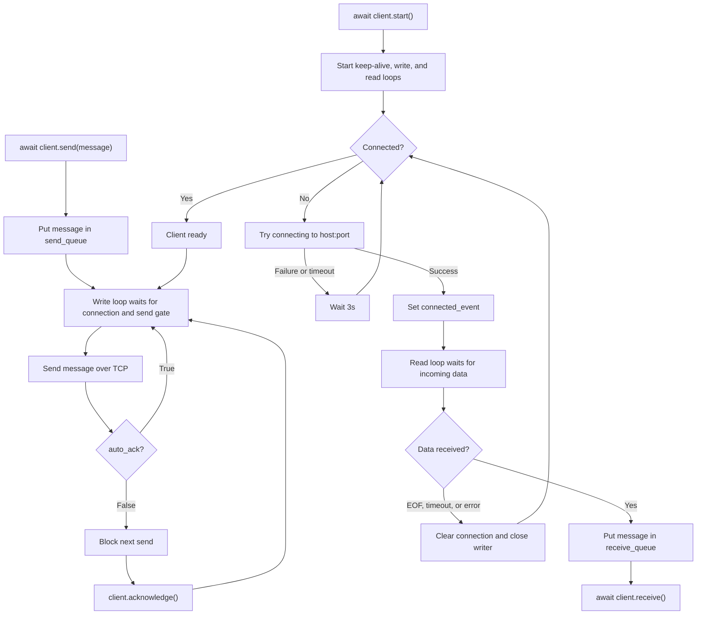

# Async TCP Client

A robust, asynchronous TCP client for Python built on top of `asyncio`. It handles automatic reconnections, queued message sending/receiving, and provides a simple acknowledgment mechanism for sequential message processing.

## Features

- **Asynchronous I/O**: Built with Python's standard `asyncio` library for non-blocking network operations.
- **Auto-Reconnection**: Resilient connection handling that automatically attempts to reconnect if the connection drops, encounters an error, or times out.
- **Message Queues**: Decoupled sending and receiving operations using asynchronous queues (`send_queue`, `receive_queue`).
- **Auto-Acknowledgement by Default**: Queued messages keep sending automatically unless manual acknowledgements are enabled.
- **Sequential Processing Control**: Set `auto_ack=False` and call `acknowledge()` to ensure a message is fully processed before the next one is transmitted over the wire.
- **Configurable Timeouts**: Support for configurable read timeouts.
- **Structured Logging**: Uses `loguru` for clear, colorized, and informative logging of connection states and background events.

## How It Works



## Usage

Here is a typical example demonstrating how to initialize the client, start it, send a message, and process incoming responses:

```python
import asyncio
from tcp import TCPClient

async def main():
    # Initialize the client pointing to your server
    client = TCPClient("localhost", 3000, read_timeout=None)
    
    # Start the client (blocks until connected)
    await client.start()

    # Queue a message to be sent
    await client.send("Hello Server!")
    
    try:
        while True:
            # Wait for the next incoming message
            response = await client.receive()
            print(f"Final Response: {response}")
    finally:
        # Stop and clean up the client connection
        await client.stop()

if __name__ == "__main__":
    asyncio.run(main())
```

To block each queued send until your application has processed the previous response, disable auto-acknowledgement:

```python
client = TCPClient("localhost", 3000, auto_ack=False)

response = await client.receive()
# Process response here...
client.acknowledge()
```

## API Reference

### `TCPClient(host, port, read_timeout=None, auto_ack=True)`
Initializes the client.
- `host` *(str)*: The server hostname or IP address.
- `port` *(int)*: The server port number.
- `read_timeout` *(float, optional)*: Maximum time to wait on a read operation before logging a timeout and attempting to reconnect. Defaults to `None` (wait indefinitely).
- `auto_ack` *(bool, optional)*: When `True`, the client automatically unlocks the next send after writing a message. When `False`, each sent message blocks the next queued send until `acknowledge()` is called. Defaults to `True`.

### Core Methods

- **`await start()`**
  Starts the background connection management, reading, and writing loops. It will wait until the first successful connection is established before returning.

- **`await send(message)`**
  Places a message into the internal send queue. The background write loop will pick it up and transmit it to the server when ready.

- **`await receive()`**
  Asynchronously retrieves the next available message from the internal receive queue. If the queue is empty, it waits until a new message arrives.

- **`acknowledge()`**
  Signals that the client is ready to send the next queued message. This is only required when `auto_ack=False`, and allows you to enforce sequential request-response flows (e.g., waiting for the server's reply to message A before sending message B).

- **`await stop()`**
  Initiates a graceful shutdown of the client. It stops background loops, closes network sockets, and triggers any disconnected states.
